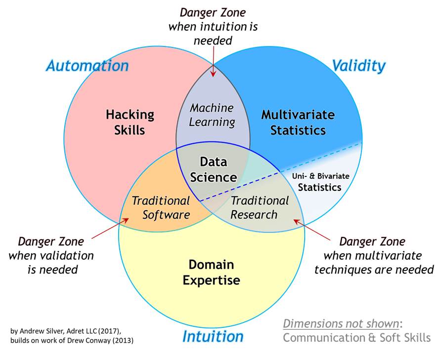

# Guide to Getting a Data Scientist Job in APAC 🌏
A collection of awesome resources to prepare for Data Science Interviews 🗣️ in Asia-Pacific

🙌 Feel free to send a pull request to update these resources! 

## Data Science

### Top Data Science Roles

Based on [this article](https://www.northeastern.edu/graduate/blog/data-science-careers-shaping-our-future/)

1. Data Scientist
2. Machine Learning Engineer
3. Machine Learning Scientist
4. Applications Architect
5. Enterprise Architect
6. Data Architect
7. Infrastructure Architect
8. Data Engineer
9. Business Intelligence (BI) Developer
10. Statistician
11. Data Analyst

## Question and Answers 
* [OVER 100 Data Scientist Interview Questions and Answers! by Terence Shin](https://towardsdatascience.com/over-100-data-scientist-interview-questions-and-answers-c5a66186769a)
* [Top 50 Data Science Interview Questions and Answers by guru99](https://www.guru99.com/data-science-interview-questions.html)
* [Data Science Interview Questions by hackr.io](https://hackr.io/blog/data-science-interview-questions)
* [Top 100 Data science interview questions by Nitin Panwar](https://nitin-panwar.github.io/Top-100-Data-science-interview-questions/?utm_campaign=News&utm_medium=Community&utm_source=DataCamp.com)
* [Springboard 109 Data Science Interview Questions and Answers
](https://www.springboard.com/blog/data-science-interview-questions/)
* [DS interviews - therotical and technical questions](https://ds-interviews.org/)
* [zhiqiangzhongddu/Data-Science-Interview-Questions-and-Answers-General](https://github.com/zhiqiangzhongddu/Data-Science-Interview-Questions-and-Answers-General-)
* [kojino/120-Data-Science-Interview-Questions](https://github.com/kojino/120-Data-Science-Interview-Questions)

## Skills

### Mathematics

#### Linear Algebra

* [Essence of linear algebra by 3Blue1Brown](https://www.youtube.com/playlist?list=PLZHQObOWTQDPD3MizzM2xVFitgF8hE_ab)
* [Linear Algebra and Learning from Data (2019)](https://math.mit.edu/~gs/learningfromdata/)

#### Stats & probability

* [Introduction to Probability and Statistics by MIT](https://ocw.mit.edu/courses/mathematics/18-05-introduction-to-probability-and-statistics-spring-2014/)
* [All of Statistics](http://www.stat.cmu.edu/~larry/all-of-statistics/)
* [Statistical Inference via Data Science](https://moderndive.com/)

#### Calculus

* [Essence of calculus by 3Blue1Brown](https://www.youtube.com/playlist?list=PLZHQObOWTQDMsr9K-rj53DwVRMYO3t5Yr)
* [Multivariarble Calculus by MIT](https://ocw.mit.edu/courses/mathematics/18-02sc-multivariable-calculus-fall-2010/)

### Programming

#### Python

* [Google's Python Course](https://developers.google.com/edu/python/)
* [Applied Data Science with Python — UMich](https://online.umich.edu/series/applied-data-science-with-python/)
* [IBM Data Science Professional Certificate](https://www.coursera.org/professional-certificates/ibm-data-science)

#### SQL

* [Mode’s SQL tutorial for Data Analysis](https://mode.com/sql-tutorial/introduction-to-sql/)
* [FreeCodeCamp — Full Database Course for Beginners](https://www.youtube.com/watch?v=HXV3zeQKqGY)
* [SQL for Data Science — UC Davis](https://www.coursera.org/learn/sql-for-data-science?)

#### Julia

* [Introduction to Computational Thinking](https://computationalthinking.mit.edu/Spring21/)
* [julia website](https://julialang.org/)

#### R

* [R for Data Science](https://r4ds.had.co.nz/)
* [Data Science specialization with R by JHU](https://www.coursera.org/specializations/jhu-data-science)

#### Git

* [git doc](https://git-scm.com/docs/gittutorial)
* [atlassian git tutorials](https://www.atlassian.com/git/tutorials)
* [try git](https://try.github.io/)

### Machine Learning

* [Learning from Data by CalTech](http://work.caltech.edu/telecourse)
* [Machine Learning](https://www.coursera.org/learn/machine-learning#instructors)
* [Introduction to Statistical learning](https://www.statlearning.com/)

### Deep Learning

* [Neural networks by 3Blue1Brown](https://www.youtube.com/playlist?list=PLZHQObOWTQDNU6R1_67000Dx_ZCJB-3pi)
* [Fast AI](https://course.fast.ai/)

### Business Acumen

1. Find the domain you're passionate about. 
1. Discover great books, articles, and podcasts that will help you effectively pick up skills in this domain. 
1. Join communitites and build a network.
1. Find mentors 

### Bonus

#### ML-Ops resources

* [visenger/awesome-mlops](https://github.com/visenger/awesome-mlops)

#### Data Engineering resources

* [Awesome Data Engineering](https://awesomedataengineering.com/)
* [Data Engineering Resources](https://diogoalexandrefranco.github.io/data-engineering-resources/)

## Advice for international jobs
1. Learn the local language if possible, even if it’s just greetings and thank you
1. Go to the country to get a visa, even if it’s for something like an English teacher position. It’s much easier to interview and be taken seriously when you’re already in your target country.

## Job boards 

### Japan
* [Bitgrit jobs](https://bitgrit.net/jobs/)
* [Japan Dev](https://japan-dev.com/)
* [Daijob](https://www.daijob.com/en/jobs/search_result?job_post_language=2&job_search_form_hidden=1&page=2&sort_order=1&keywords=Data+Scientist)
* [Rakuten’s global data science team](https://global.rakuten.com/corp/careers/lp/data_engineer/)

### Singapore
* [JobStreet](https://www.jobstreet.com.sg/en/job-search/data-scientist-jobs/)
* [JobsDB](https://sg.jobsdb.com/Data-Scientist-jobs)
* [Efinancialcareers](https://www.efinancialcareers.sg/jobs-Data_Scientist-Singapore.to014701880251)

### Malaysia
* [JobStreet](https://www.jobstreet.com.my/en/job-search/data-scientist-jobs-in-malaysia/)
* [Glassdoors](https://www.glassdoor.com/Job/malaysia-data-scientists-jobs-SRCH_IL.0,8_IN170_KO9,24.htm)
* [careerjet](https://www.careerjet.com.my/data-scientist-jobs.html)

### Australia
* [Jora](https://au.jora.com/Data-Scientist-jobs-in-Australia)
* [Indeed](https://au.indeed.com/Data-Scientist-jobs)
* [Seek](https://www.seek.com.au/data-scientist-jobs)

### South Korea

* [glassdoor](https://www.glassdoor.com/Job/south-korea-data-scientist-jobs-SRCH_IL.0,11_IN135_KO12,26.htm)
* [jooble](https://jooble.org/jobs-data-science/South-Korea)
* [linkedin](https://www.linkedin.com/jobs/analyst-jobs-korea/?trk=amworks_jserp_redirect&position=1&pageNum=0)

## Other awesome Data Sciecne interview repos
* [Cracking-the-Data-Science-Interview](https://github.com/ml874/Cracking-the-Data-Science-Interview) by ml874
* [cracking-the-data-science-interview](https://github.com/khanhnamle1994/cracking-the-data-science-interview
) by khanhnamle1994

## Data Science resources repos
* [academic/awesome-datascience](https://github.com/academic/awesome-datascience)
* [tirthajyoti/Data-science-best-resources](https://github.com/tirthajyoti/Data-science-best-resources)
* [cdeweyx/DS-Career-Resources](https://github.com/cdeweyx/DS-Career-Resources/blob/master/Interview-Resources.md)

## Concluding advice/CTA

1. Learn from courses and books
1. Apple what you learn with personal projects
1. Choose a few important ones and present them on GitHub 
1. Apply for jobs
1. Refresh concepts with resources to prepare for interview

